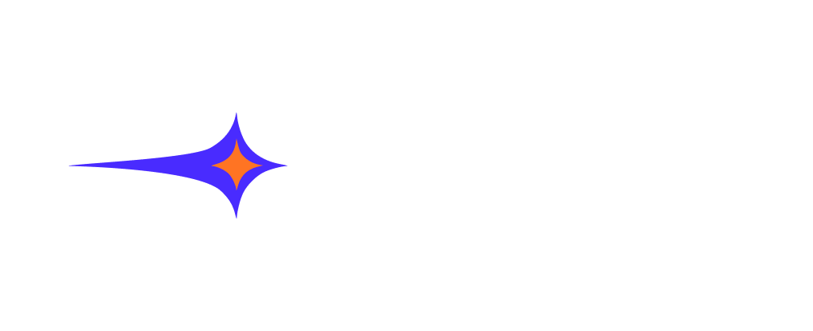
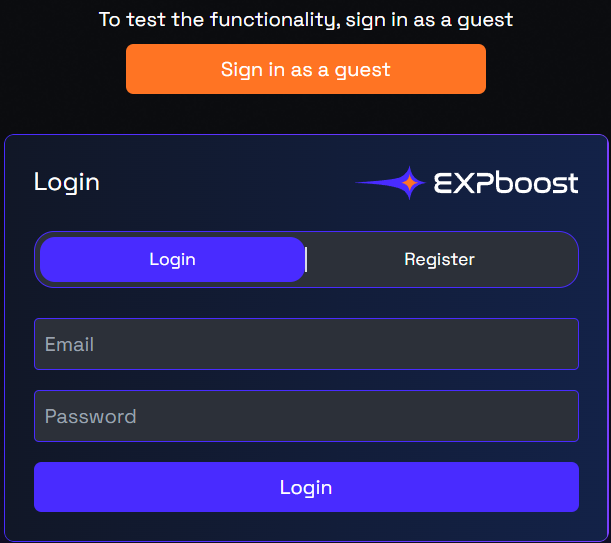
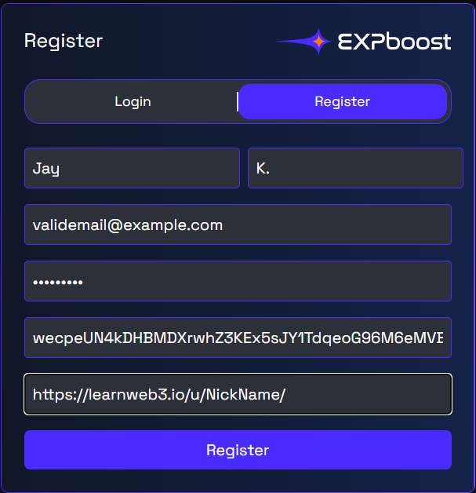

<!-- PROJECT LOGO -->
 

  

<h3 align="center">EXPboost</h3>

  

    A platform that boosts course completion rates through gamified tasks and rewards
     
    <a href="https://www.loom.com/share/293aeb6404df42f7a152d395d55674ea">View Demo</a>
  

<!-- TABLE OF CONTENTS -->

  
Table of Contents

  <ol>
    <li>
      <a href="#about-the-project">About The Project</a>
    </li>
    <li><a href="#usage">Usage</a></li>
    <li><a href="#roadmap">Roadmap</a></li>
    <li><a href="#contact">Contact</a></li>
  </ol>

<!-- ABOUT THE PROJECT -->

## About The Project

[![Product Name Screen Shot][product-screenshot]](https://expboost-b8d6404eeffb.herokuapp.com/)
Our platform boosts course completion across different learning platforms with engaging tasks, gamified challenges, and rewards like NFTs or tokens. We don’t offer courses but reward you for completing them. Finish daily, weekly, and long-term missions to earn free or premium rewards, with new seasons bringing fresh challenges

(<a href="#readme-top">back to top</a>)

<!-- USAGE EXAMPLES -->

## Usage

1. To make it easier to test our project, we've added the ability to sign in as a guest to avoid any initial setup. Please, use this option if you want to test the application as fast as possible.

    

    If you have chosen this option, you can go straight to 4th step.

2. If you did not choose sign in as a guest, before testing need to create account on [LearnWeb3](https://learnweb3.io/). It's the only platform we support for demo. Copy the link of your profile (it should look like `https://learnweb3.io/u/<UserNickname>/`). In the Wallet Address type your wallet from **Solana Devnet**.

    

3. After being redirected to the dashboard, you will see 2 active daily tasks. **Earn 1 more budge!** is already available to be checked, as you got this budge when registered on LearnWeb3. To complete the second task, you should first get experience on LearnWeb3.

4. Click on **Check** button. Processing could take some time, but if all requirements are satisfied, you will get an alert with a link to your NFT transaction.

(<a href="#readme-top">back to top</a>)

<!-- ROADMAP -->

## Roadmap

1. Initial Setup & Basic Functionality
    - Launch account profiles
    - Integrate wallet connect for NFT and token rewards
2. Core Features & User Engagement
    - Implement daily tasks and challenges
    - Introduce NFT rewards and establish a token economy
3. Expansion & Monetization
    - Launch basic and premium subscription models for additional features
4. Partnerships & Advanced Functionality
    - Establish partnerships with major learning platforms for course integration
5. Community & Growth
    - Develop community engagement features
    - Incorporate user feedback for continuous improvement and feature updates

(<a href="#readme-top">back to top</a>)

## Contact

Project X - [@EXPboost\_](https://x.com/EXPboost_)

Project Link: [https://expboost-b8d6404eeffb.herokuapp.com/](https://expboost-b8d6404eeffb.herokuapp.com/)

Creators:

-   Jay - Team Leader, Backend developer: [@JayKitchan](https://x.com/JayKitchan)
-   Rinat - Frontend developer: [@RinatMiniY](https://x.com/RinatMiniY)
-   Kristina - UX/UI and Graphic designer: [@Kristina_Visual](https://x.com/Kristina_Visual)

(<a href="#readme-top">back to top</a>)

<!-- MARKDOWN LINKS & IMAGES -->
<!-- https://www.markdownguide.org/basic-syntax/#reference-style-links -->

[product-screenshot]: backend/static/images/preview.png
